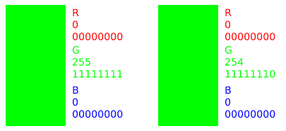

# Esteganografia com método LSB
Repo com implementação do método LSB para ocultar uma mensagem dentro de um imagem (sem alterar a aparência da mesma de forma significativa).

Para esconder uma informação dentro de uma imagem:
```bash
$ python steganography.py encode "nome_do_arquivo.png" --message "mensagem a ser escondida" --out-file "imagem_com_texto_secreto.png"
```

O parâmetro `--out-file` é opcional.

Para ler a informação ocultada:
```bash
$ python steganography.py decode "nome_do_arquivo.png"
```
<p align=center>
     
</p>

Apesar das imagens serem visualmente iguais, ao "decodar" a segunda imagem acima, obtêm-se a mensagem "Photo by Marliese Streefland on Unsplash". A esteganografia pode ser uma forma de "assinar" imagens digitais.

## Sobre a esteganografia
A esteganografia é o ato de ocultar informação se utilizando de uma cobertura (isto é, uma mídia que servirá para esconder essa informação). Dependendo do tipo, essa cobertura recebe nomes como *cover image* (se for uma imagem), *cover audio*, *cover text*, entre outros. 

Após o processo de ocultação, obtêm-se um *stego-object* (estego-objeto).

## Sobre o método LSB
O método LSB (do inglês *least significant bit*, bit menos significativo) se baseia em alterar o valor das canais de cores dos pixels de uma imagem a fim de encodar uma mensagem.

Uma imagem .png é formada por pixels que, por sua vez, possuem até 4 bytes, representando os canais da imagem (R, G, B, que são os canais de cores, e o A, que controla a transparência do pixel). Cada byte possui 8 bits, sendo o bit mais a direita o bit menos significativo.

Esse bit recebe esse nome pois altera o valor do byte em apenas uma unidade. Então, ao ser modificado, não altera o visual da imagem de modo perceptível, como abaixo:

<p align="center">
    
</p>

Os dois exemplos acima são visivelmente iguais, mas tecnicamente representam duas cores diferentes (#00FF00 e #00FE00). O que muda nelas é o bit menos significativo.

Podemos usar esse bit menos significativo para "salvar" uma mensagem (em sua representação binária).

## Referências

http://www.libpng.org/pub/png/book/chapter08.html

https://www.ic.unicamp.br/~rocha/msc/project/exquali.pdf
